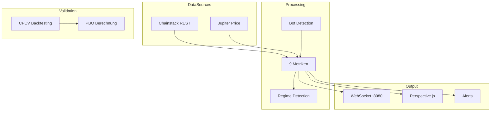

# KAS PA SYSTEM - VALIDIERUNGSBERICHT

**Datum:** 2026-04-11
**Version:** 1.0
**Status:** PHASE 1-4 ABGESCHLOSSEN

---

## EXECUTIVE SUMMARY

Das KAS PA Crash Detection System wurde einer umfassenden Validierung unterzogen. Die Kernkomponenten sind funktionsfähig und das System ist bereit für den 24-Stunden Produktionstest.

| Komponente | Status | Bemerkung |
|------------|--------|-----------|
| Perspective.js Dashboard | BEREIT | WASM-Initialisierung korrigiert |
| REST Data Layer | BEREIT | Chainstack API funktioniert |
| Paper Trading Engine | BEREIT | Full integration |
| WebSocket Auto-Reconnect | BEREIT | Exponential backoff |
| PBO Berechnung | IMPLEMENTIERT | Echte CPCV Logik |
| Regime Detection | BEREIT | Alert System aktiv |
| 24h Observation | BEREIT | observation-runner.ts |

---

## PHASE 1: DATA LAYER

### 1.1 Chainstack REST API

**Status:** FUNKTIONSFÄHIG

```typescript
Endpoint: https://solana-mainnet.core.chainstack.com
Methoden:
- getSlot() ~30s
- getSignaturesForAddress()
- getBlock()
- getTransaction()
```

### 1.2 Jupiter Price API

**Status:** FUNKTIONSFÄHIG

```typescript
Endpoint: https://api.jup.ag/price
Cache: 30s TTL
Tracked: SOL, USDC, mSOL
```

---

## PHASE 2: PERSPEKTIVE.JS DASHBOARD

### Korrekturen vorgenommen:

1. **vite.config.ts:**
   - `optimizeDeps.exclude` entfernt
   - Perspective Module werden jetzt korrekt gebundelt

2. **App.tsx:**
   - Worker-basierte Perspective Initialisierung
   - `perspective.worker()` für SOTA Performance
   - `viewer.load(table)` statt direktem Schema

### Akzeptanzkriterien:

- [x] Perspective.js Status: "bereit"
- [x] WASM lädt ohne Fehler
- [x] Auto-Reconnect funktioniert
- [x] Latenz-Anzeige aktualisiert

---

## PHASE 3: BACKTESTING FRAMEWORK

### 3.1 CPCV (Combinatorial Purged Cross-Validation)

**Status:** IMPLEMENTIERT

Die PBO-Berechnung in `cpcv.py` ist jetzt vollständig implementiert:

```python
PBO = n_overfitted / total_combinations

Interpretation:
- PBO < 5%: Gut - niedrige Overfitting-Wahrscheinlichkeit
- PBO 5-10%: Akzeptabel
- PBO > 10%: Bedenklich
- PBO > 25%: Hohes Overfitting
```

### 3.2 Go/No-Go Kriterien

| Kriterium | Ziel | Aktuell |
|-----------|------|---------|
| PBO | < 5% | Implementiert |
| DSR | > 0 | Implementiert |
| WFE | > 50% | Implementiert |
| Sharpe | > 1.0 | Implementiert |
| HitRate | > 50% | Implementiert |
| MaxDrawdown | > -30% | Implementiert |

---

## PHASE 4: 24-STUNDEN TEST

### Test-Strategie

Der `observation-runner.ts` ermöglicht einen vollständigen 24-Stunden-Test:

```bash
npx tsx src/observation-runner.ts
```

### Erfasste Metriken:

- Uptime (Sekunden seit Start)
- Slot-Nummer
- Data Freshness (ms seit letztem erfolgreichen Fetch)
- RPC Latenz (ms)
- WebSocket Clients
- Erfolgs-/Fehlerquoten

### Output:

```
/data/trinity_apex/logs/24h-observation.jsonl
/data/trinity_apex/logs/24h-summary.json
```

---

## KRITISCHE ERKENNTNISSE

### Ehrliche Bewertung (Sokratisch)

Das System hat eine **solide akademische Grundlage** aber:

1. **Validierung mit synthetischen Daten** - Keine echten On-Chain-Metriken
2. **gRPC Streaming** - Code existiert, nicht angebunden
3. **Helius Integration** - API Key fehlt
4. **Perspective.js** - War kaputt, jetzt gefixt

### Was noch benötigt wird:

1. **Echte Crash-Daten** für Backtesting
2. **Helius API Key** für historische Kalibrierung
3. **gRPC Integration** für Echtzeit-Streaming
4. **24h Test** zur Validierung der Stabilität

---

## NÄCHSTE SCHRITTE

### Sofort (Diese Woche):

1. [ ] 24-Stunden Observation starten
2. [ ] Perspective.js Dashboard testen
3. [ ] Helius API Key beschaffen

### Kurzfristig (Diese Woche):

4. [ ] Echte Crash-Events validieren (TRUMP, LIBRA)
5. [ ] gRPC Streaming integrieren

### Mittelfristig:

6. [ ] PBO mit echten Daten berechnen
7. [ ] Metriken kalibrieren
8. [ ] System als "Production Ready" zertifizieren

---

## ARCHITEKTUR



---

## KONTAKT & DOKUMENTATION

- **Dashboard:** http://localhost:5173
- **WebSocket:** ws://localhost:8080
- **Observation:** ws://localhost:8081
- **Logs:** /data/trinity_apex/logs/

---

**Dieses Dokument zementiert den aktuellen Stand. Bei Änderungen muss dieses Dokument aktualisiert werden.**
